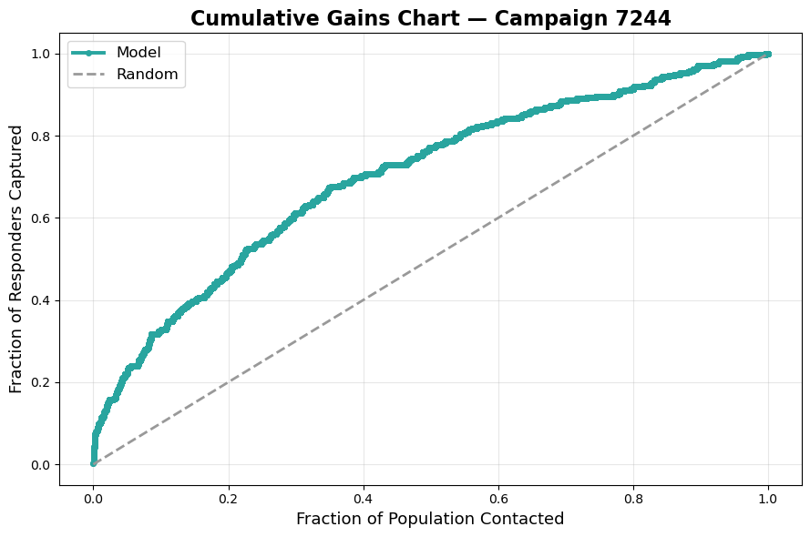
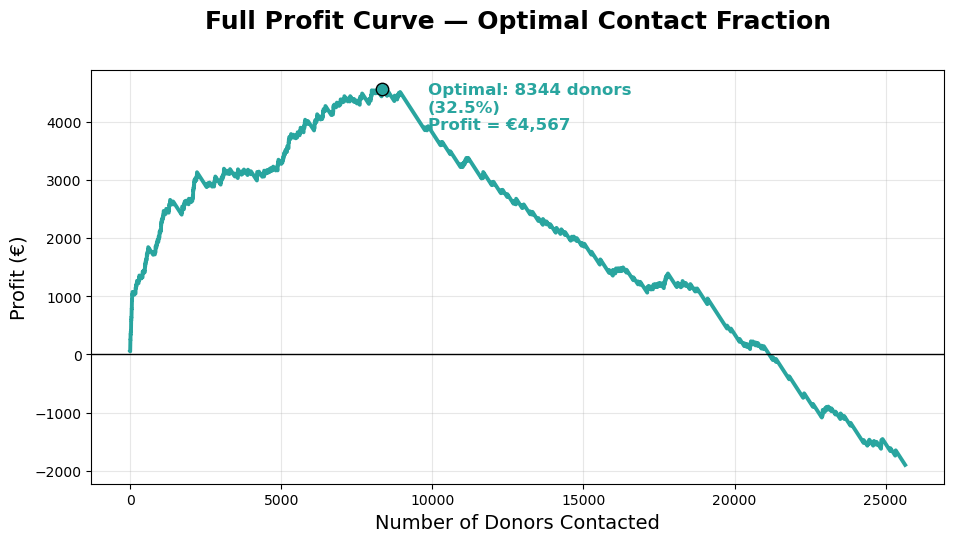
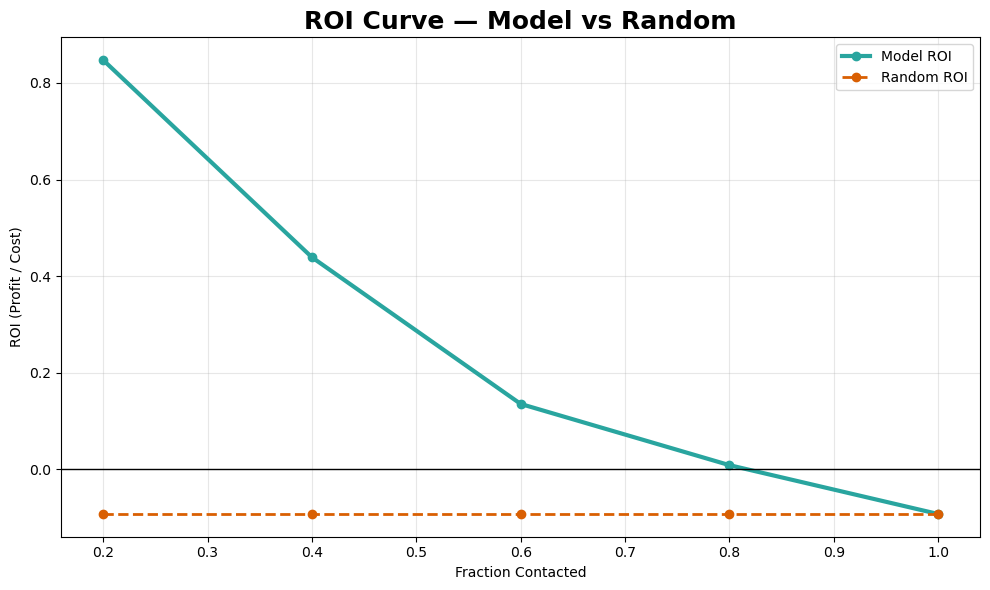

# Donor Reactivation Prediction — Descriptive & Predictive Analytics

## Project Overview
Non-profit organizations often rely on reactivation campaigns to re-engage inactive donors.
However, contacting the entire donor base is costly and often leads to negative returns.

This project aims to **predict which inactive donors are most likely to donate €30 or more**
and to demonstrate how predictive analytics can significantly improve campaign profitability
compared to random targeting.

The project was developed as part of an academic group assignment in **Descriptive and Predictive Analytics**.

---

## Business Problem
- High mailing costs (€0.80 per letter)
- Low response rates when contacting all inactive donors
- Need to optimize donor selection under budget constraints

**Goal:**  
Identify a subset of donors that maximizes profit while minimizing campaign costs.

---

## Data
The analysis is based on **synthetic datasets provided for educational purposes**, simulating:
- Donor demographic information
- Historical donation behavior
- Past reactivation campaigns
- Campaign cost information

All datasets are included in the repository to ensure reproducibility.

---

## Methodology
1. Data cleaning and exploration  
2. Feature engineering from historical donation behavior  
3. Feature selection to reduce dimensionality  
4. Model training and comparison  
5. Model evaluation using:
   - AUC
   - Lift curve
   - Cumulative gains
6. Business case simulation to identify the optimal contact strategy

---

## Key Results
- **Best model:** CatBoost  
- **Validation performance:** AUC = **0.7017** on an independent campaign  
- **Efficiency:** Top **30–40%** of donors captures ~**60–70%** of responders  
- **Optimal strategy:** Contact ~**33%** of donors  
- **Profit at optimum:** **€4,567**  
- **Net uplift vs random targeting:** **+€6,467**  
- **Return on investment:** **+68%**

---
## Model Performance & Business Impact

### Cumulative Gains — Campaign 7244
The model captures a disproportionate share of donors in the top-ranked segments,
clearly outperforming random targeting.


### Profit Optimization
The profit curve highlights the optimal contact strategy (~33% of donors),
maximizing total campaign profit.


### ROI Comparison
Model-driven targeting consistently outperforms random selection across all contact fractions.


## Business Impact
The results show that random targeting leads to systematic losses, while a model-driven
approach enables profitable and scalable fundraising campaigns.

By focusing on high-probability donors, the organization can:
- Reduce mailing costs
- Increase expected revenue
- Make data-driven campaign sizing decisions

---

## Repository Structure
```text
donor-reactivation-prediction/
├── data/           # Raw datasets (synthetic)
├── notebooks/      # Jupyter notebook with full analysis
├── outputs/        # Figures and model evaluation results
├── presentation/   # Final presentation slides
└── README.md
```

---

## Tools & Technologies
- Python (pandas, numpy, scikit-learn)
- CatBoost
- Jupyter Notebook
- Matplotlib / Seaborn

---

## Author Contribution
This project was developed as part of a group assignment.

My personal contribution focused on:
- Feature engineering
- Model training and tuning
- Model evaluation
- Business case analysis and interpretation
